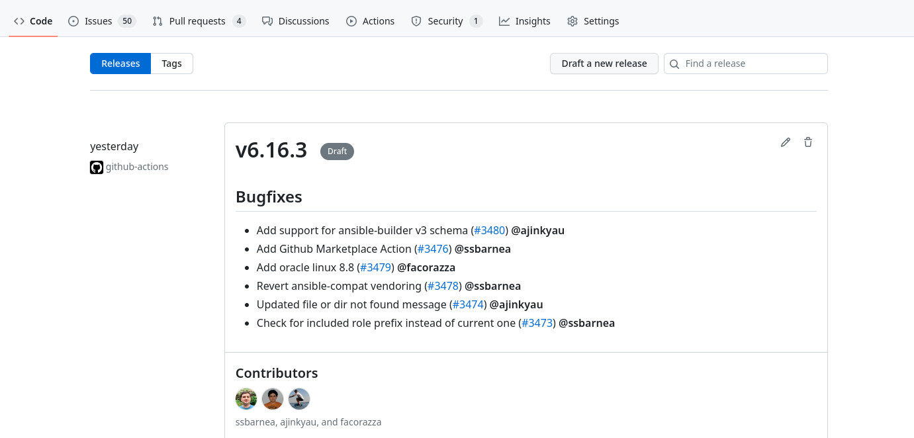

# Release process for python packages

Thanks to the integrations which are in place, it is very easy to release a newer version of our python projects i.e. [ansible-lint], [ansible-navigator], [ansible-compat] and [molecule].

[ansible-lint]:https://github.com/ansible/ansible-lint
[ansible-navigator]:https://github.com/ansible/ansible-navigator
[ansible-compat]:https://github.com/ansible/ansible-compat
[molecule]:https://github.com/ansible-community/molecule

Anyone with appropriate permission to the respective projects will be able to rollout a new release.

If we go to the Github **Releases** section, we'll be able to see something like:

This shows the upcoming version with changes to be included in the next release.

We use [release-drafter](https://github.com/release-drafter/release-drafter) which helps us to get the changelog for the releases.
When a PR is merged, release-drafter runs and adds PR details to the changelog as shown above.

# Releasing a new version
Go to `Draft a new release` inside Github releases and release it! while being sure that you create a discussion thread for it. This will create a new tag.
Once released, the latest version will be deployed and published to PyPI registry.

This release process is applicable to all our python based projects.
